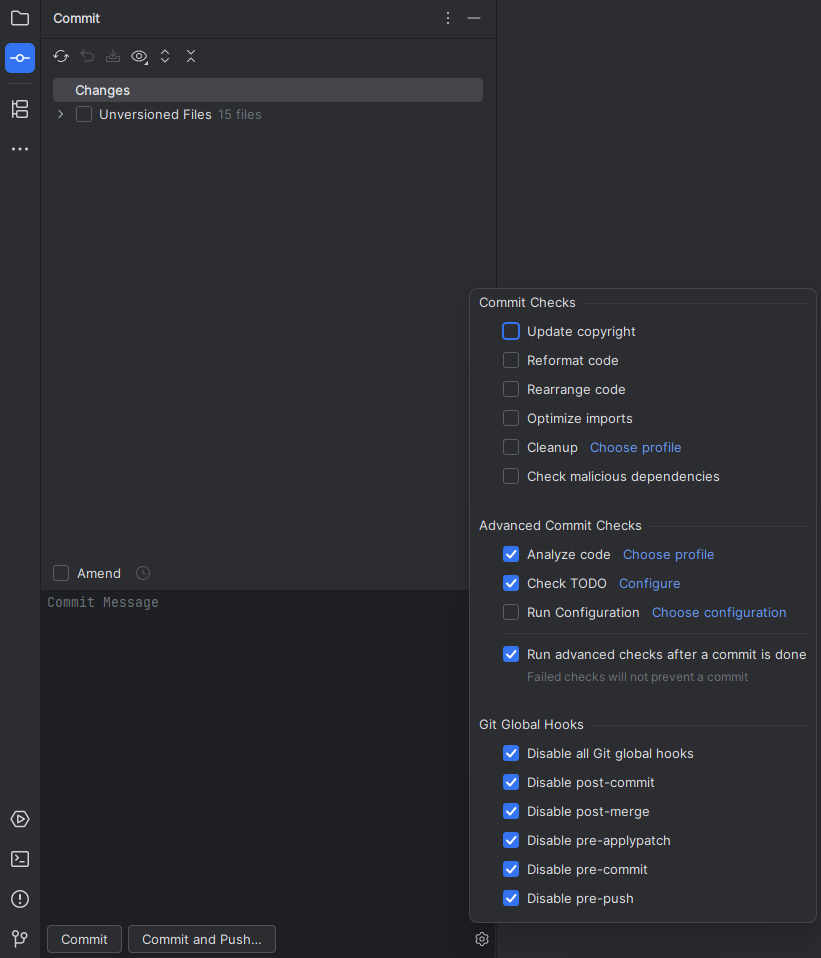

# GitGlobalHooksLocator


[](https://plugins.jetbrains.com/plugin/23182-git-global-hooks-locator)
[](https://plugins.jetbrains.com/plugin/23182-git-global-hooks-locator)

<!-- Plugin description -->
Intellij plugin to enable or disable global Git hooks

Hooks are programs you can place in a hooks directory (specified in core.hooksPath) to trigger actions at certain points in git’s execution.
Unfortunately, Intellij can only keep track of local hooks located inside a project.
With this plugin, you can enable or disable your global Git hooks directly from the IDE.

The following hooks are available:
- pre-commit
- prepare-commit-msg
- commit-msg
- post-commit
- applypatch-msg
- pre-applypatch
- post-applypatch
- pre-rebase
- post-rewrite
- post-checkout
- post-merge
- pre-push
- pre-auto-gc
<!-- Plugin description end -->



## Getting Started
Configure the `core.hooksPath` parameter in global `.gitconfig` according to the [Git documentation](https://git-scm.com/docs/githooks). 
You can also use the following command:
```
git config --global core.hooksPath {PATH_TO_HOOKS_FOLDER}
```
If `core.hooksPath` is not specified, the plugin will use the following path by default:
```
~/.git/hooks
```

## Installation

- Using the IDE built-in plugin system:
  
  <kbd>Settings/Preferences</kbd> > <kbd>Plugins</kbd> > <kbd>Marketplace</kbd> > <kbd>Search for "GitGlobalHooksLocator"</kbd> >
  <kbd>Install</kbd>
  
- Manually:

  Download the [latest release](https://github.com/y0ung3r/GitGlobalHooksLocator/releases/latest) and install it manually using
  <kbd>Settings/Preferences</kbd> > <kbd>Plugins</kbd> > <kbd>⚙️</kbd> > <kbd>Install plugin from disk...</kbd>
